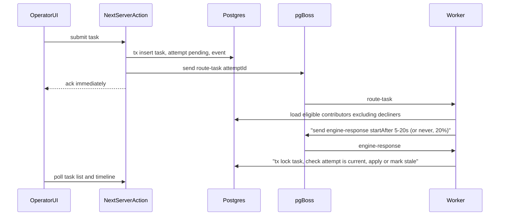
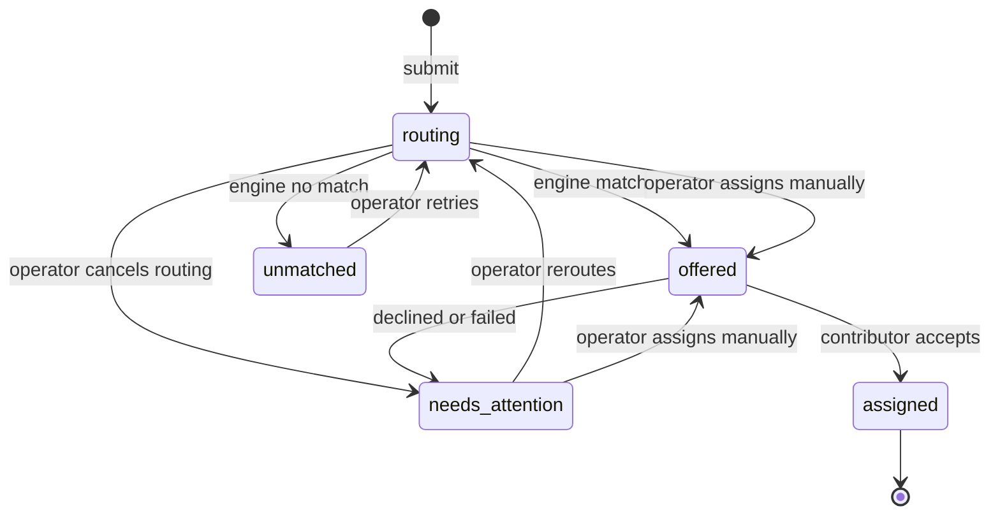

# Terac Routing Desk: Implementation Plan

## Stack (all free, runs locally)
- **App:** Next.js (App Router, TypeScript) with Tailwind and shadcn/ui. TanStack Query polls every 1.5s to keep the screen current.
- **Database:** Postgres 16 in `docker-compose.yml`, accessed through Prisma ORM. `prisma/schema.prisma` defines the schema, `prisma migrate` handles migrations, and `prisma/seed.ts` loads seed data. One shared `PrismaClient` singleton (`src/db/client.ts`) is used by both Next and the worker.
- **Queue:** pg-boss, which stores its jobs in the same Postgres database. Delayed jobs (`startAfter`) survive restarts.
- **Worker:** a separate Node process (`src/worker/index.ts`, run with `tsx`). `npm run dev` starts both Next and the worker using `concurrently`.
- **Validation and tests:** Zod and Vitest. Tests run against the Docker Postgres.

## Core idea: the database is the truth, and stale engine responses are ignored
Every routing request is a row in `routing_attempts`. A task points to its current attempt. When the engine responds, the worker locks the task row (`SELECT ... FOR UPDATE`) and applies the result only if that attempt is still the task's current one and still `pending`. Otherwise the response is stored as `late_response_ignored` and logged. This one rule covers:
- the operator stepping in while a request is pending,
- a request that responds after the operator has moved on,
- pg-boss delivering the same job more than once (it guarantees at least one delivery, not exactly one),
- restarts. Delayed response jobs live in Postgres, and requests that will never respond simply stay `pending`.

## Data model ([prisma/schema.prisma](prisma/schema.prisma))
Statuses, actors and scenarios are Prisma `enum`s. Many-to-many joins use explicit join models so they're easy to query and seed.
- `expertise` (finance, healthcare, data_analysis, operations)
- `contributors`, `contributor_expertise` (many-to-many)
- `tasks`: `title`, `priority`, `status`, `current_attempt_id`, `contributor_behavior`, `created_at`
- `task_expertise` (many-to-many)
- `routing_attempts`: `task_id`, `status` (`pending|matched|no_match|cancelled|late_response_ignored`), `scenario`, `simulated_fate` (debug only, visible behind a "reveal" toggle), `expected_by`, `created_at`, `resolved_at`
- `assignments`: `task_id`, `contributor_id`, `attempt_id`, `status` (`offered|accepted|declined|failed|revoked`)
- `task_events`: an append-only audit trail (`type`, `actor`: system/engine/operator/contributor, `payload` jsonb, `created_at`)
- Constraints enforced by the database:
  - A partial unique index on `assignments(task_id) WHERE status IN ('offered','accepted')` means a task has at most one active assignee.
  - A partial unique index on `routing_attempts(task_id) WHERE status='pending'` means a task has at most one live attempt.
  - Prisma's schema language can't express partial indexes. Both are added in a hand-written migration, created with `prisma migrate dev --create-only` and then edited, and commented in `schema.prisma` so nobody misses them. A violation surfaces as Prisma error `P2002`, which the domain layer translates into a clear conflict error.
- Row locking: Prisma has no `FOR UPDATE` API. Inside `prisma.$transaction(async (tx) => ...)`, the guard runs `` tx.$queryRaw`SELECT id FROM tasks WHERE id = ${id} FOR UPDATE` `` and the rest of the transaction uses the normal typed client.

## Task states

## Domain and extensibility (`src/domain`, `src/routing`)
- `src/domain/taskService.ts` holds the commands: `submitTask`, `cancelRouting`, `rerouteTask`, `assignManually`, `applyEngineResponse`, `applyContributorResponse`. Each command runs in one transaction and writes a `task_events` row.
- `src/routing/selectionStrategy.ts` defines the `ContributorSelectionStrategy` interface with `select(task, eligible): Contributor | null`, plus `RandomSelectionStrategy`. A strategy registry makes it easy to add new ones (least loaded, round robin).
- `src/routing/routingEngine.ts` defines a `RoutingEngine` interface and a `SimulatedRoutingEngine`. The simulated engine decides the outcome, the delay and whether it will ever respond, using `scenario`: `random` (5 to 20s delay, 20% never respond), `fast_match`, `slow_match`, `never_returns` or `no_match`.
- Eligible contributors are the ones whose expertise overlaps the task's, minus anyone who declined or failed this task before. That exclusion is derived from `assignments`.
- Contributor simulation (no contributor UI): contributors never act through an interface. After an offer, the worker runs a `contributor-response` job with a short delay (2 to 6s). It accepts by default and declines or fails with small probabilities. The task's `contributor_behavior` scenario (`auto`, `always_accept`, `always_decline`, `fail_before_start`) can force a specific outcome, so the recovery use case is easy to demo. These events are logged with `actor: contributor (simulated)`.

## Worker ([src/worker/index.ts](src/worker/index.ts))
- Queues: `route-task`, `engine-response`, `contributor-response`.
- Handlers are thin. They call domain commands and rely on the attempt and assignment guards, so running the same job twice is harmless.
- On startup, a reconciler re-enqueues any `pending` attempt that has no `route-task` job yet. This covers a crash between the database commit and the pg-boss `send`.

## Operator UI (`src/app`): the only UI
Every page is for the operator. There are no contributor pages, logins or accept/decline buttons.

- `/` is the task board. Each row shows title, expertise, priority, status badge, time since created, current assignee, and the routing request's age compared with the expected 5 to 20s. After 20s the row shows "Overdue, may never return" instead of guessing. You can filter by status.
- `/tasks/new` is a create form: expertise (multi-select), priority, and two demo scenario selectors, one for engine behaviour and one for simulated contributor behaviour.
- `/tasks/[id]` is the task detail page: actions for the current state (cancel routing, reroute, assign manually from eligible contributors, revoke), the attempt history, and the event timeline. Late responses are shown clearly ("Engine responded 34s later; ignored because operator rerouted").
- `/contributors` is a read-only roster for the operator: each contributor's expertise and their assignments with status (offered, accepted, declined, failed).

## Seed data and documentation
- `prisma/seed.ts` (wired through the `prisma.seed` field in `package.json`) creates about 8 contributors across 4 expertise areas and about 6 tasks in a mix of states.
- `README.md` covers setup (`docker compose up -d && npm i && npx prisma migrate dev && npx prisma db seed && npm run dev`), the key decisions (attempt ownership, no automatic timeout, operator-driven recovery, excluding decliners), assumptions and intentional omissions (no auth, no contributor UI, polling instead of a push channel), and a session map.

## Tests (Vitest)
- A late engine response after a reroute is ignored and logged.
- A duplicate `engine-response` job doesn't create a second assignment.
- Rerouting leaves out contributors who previously declined.
- No eligible contributors leads to `no_match` and `unmatched`.
- Restart: pending attempts and delayed jobs are still there after a new worker starts.
