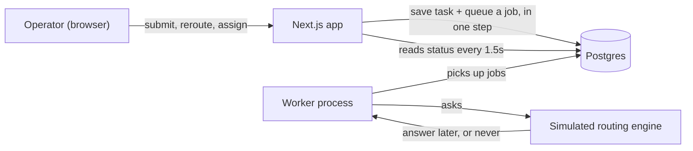

# Terac Routing Desk

A small app for the person who keeps an eye on task routing: the **operator**.

Tasks need someone with the right expertise (finance, healthcare, data analysis, operations). An automatic **routing engine** tries to find that person. Sometimes it's quick, sometimes it's slow, and sometimes it never answers at all. This app lets the operator see what's going on, step in whenever they want, and pick things back up when an assignment falls through.

Everything runs on your machine and costs nothing.

---

## Getting started

You'll need **Node.js 22.12 or newer** and **Docker** (Docker Desktop is fine).

```bash
# 1. Create your local settings file
cp .env.example .env

# 2. Start the database (Postgres runs in Docker on port 5433)
docker compose up -d

# 3. Install packages (this also generates the database client)
npm install

# 4. Create the tables and load some example data
npx prisma migrate dev
npx prisma db seed

# 5. Start the app and the background worker together
npm run dev
```

Then open **http://localhost:3000**.

`npm run dev` starts two things side by side, and you'll see both in the terminal output:

- **web**: the Next.js app you use in the browser.
- **worker**: a background process that talks to the (simulated) routing engine and the (simulated) contributors.

Both need to be running for tasks to move. If only the web app is running, tasks wait patiently and pick up where they left off once the worker starts.

To get back to the example data at any time, run `npx prisma db seed` again.

---

## A two-minute tour

The example data covers every situation in the brief, so you can look around before creating anything.

| Task | What it shows |
| --- | --- |
| Q3 revenue reconciliation | The happy path: matched, offered, accepted. |
| Hospital staffing model | A request the engine will never answer. It just keeps waiting. |
| Clinical trial site feasibility review | A contributor declined. Needs a decision. |
| Patient cohort churn analysis | A contributor dropped out before starting. Needs a decision. |
| Pharma pricing benchmark | Nobody has both finance and healthcare expertise, so no match. |
| Vendor onboarding process audit | The operator rerouted a slow request, then the original answer arrived late and was ignored. |

Click any task to see its full history.

### Try it yourself

**Routine assignment.** Click **New task**, pick *Finance*, choose the **Fast match** engine and **Always accept** contributor, then submit. You'll land on the task page and watch it go from *Routing* to *Offered* to *Assigned* in about 10 seconds.

**Stepping in while a request is pending.** Create a task with the **Slow match** engine (it answers after 35 seconds). While it's waiting, click **Reroute now** and choose **Fast match**. The new request finishes first. When the old one finally answers, the history shows it arrived and was ignored.

**Recovering from a decline.** Open *Clinical trial site feasibility review* and click **Assign directly**. Ben Okafor is greyed out because he already declined this task. Pick someone else, or use **Route again** to let the engine choose. Ben won't be offered it again either way.

**Restarting mid-flight.** Create a *Slow match* task, then stop `npm run dev` with Ctrl+C. Wait a bit and start it again. The task carries on and finishes on its own.

The **Simulation controls** on the new-task form only exist for demos. They let you decide ahead of time how the pretend engine and the pretend contributor will behave. On a task page, **Reveal simulated fate** shows what the pretend engine had already decided. A real operator would never see that.

---

## How it works



1. **Submitting a task** saves it and adds a *route this task* job to a queue, both in the same database transaction. The browser gets an answer straight away; nothing waits for the engine.
2. **The worker** picks up the job, works out who is eligible, and hands the request to the simulated engine.
3. **The simulated engine** decides when it will answer (normally 5–20 seconds) and with whom, or decides it will never answer (20% of the time). An answer is just another job scheduled for later.
4. **When an answer arrives**, the worker checks whether that request is still the one the task is waiting on. If it is, it applies it: offers the task to the chosen contributor. If the operator has already moved on, the answer is written into the history and otherwise ignored.
5. **The simulated contributor** answers the offer a few seconds later: accept, decline, or drop out.
6. **The browser** checks for updates every 1.5 seconds, so pages stay live without a refresh.

The queue is [pg-boss](https://github.com/timgit/pg-boss), which stores its jobs in the same Postgres database. That's why a restart loses nothing: jobs that are due later, including an engine answer due in 30 seconds, are rows in a table.

---

## Decisions worth knowing about

**The database is the source of truth.** Every change to a task happens inside one database transaction that locks that task's row. Two things touching the same task at the same moment (say, the operator clicks *Reroute* just as the engine answers) are handled one after the other, never both at once.

**Only the current request counts.** Each time a task is sent to the engine, that's a new *routing attempt*. A task has at most one attempt in flight. When the operator reroutes, cancels or assigns someone directly, the in-flight attempt is closed (marked *superseded* or *cancelled*). If the engine answers it later, the answer is kept in the history and changes nothing. This one rule handles late answers, double deliveries from the queue, and restarts.

**We never guess whether a request is dead.** The brief says the operator can't know whether a pending request is slow or will never return, so the app doesn't pretend to. It shows how long the request has been waiting and nothing more: no countdown, no "overdue" warning, no automatic failure. The operator decides when to stop waiting. The only warning on a waiting task is about our own system: if the worker hasn't picked a request up within 5 seconds, it says so, because that usually means the worker isn't running.

**At most one active assignee, enforced by the database.** Besides the application checks, Postgres itself refuses a second active offer or a second in-flight attempt for the same task. These are *partial unique indexes*. Prisma can't describe those, so they live in a hand-written migration: [`prisma/migrations/20261001011044_partial_unique_indexes/migration.sql`](prisma/migrations/20261001011044_partial_unique_indexes/migration.sql).

**Jobs are queued in the same transaction as the change that needs them.** pg-boss can write its job using our open Prisma transaction. So either the task change and its follow-up job both happen, or neither does. As an extra safety net, the worker re-queues any request that never reached the engine when it starts up.

**Someone who declined or failed a task is never offered it again.** That applies to rerouting and to direct assignment. The direct-assignment list shows them greyed out, with the reason.

**Swappable pieces.** How a contributor gets chosen is a small *selection strategy* ([`src/routing/selectionStrategy.ts`](src/routing/selectionStrategy.ts)). Today it picks at random among eligible people; adding "least busy" or "round robin" means writing one class and registering it. The engine itself sits behind a `RoutingEngine` interface ([`src/routing/routingEngine.ts`](src/routing/routingEngine.ts)), so a real engine could replace the simulated one without touching the rest.

---

## Assumptions

- **Matching is by expertise only.** There's a fixed list of expertise areas. A contributor is eligible when they have *every* area the task needs. Availability, workload and time zones are ignored.
- **Contributors respond automatically.** There's no contributor interface. After an offer, the worker answers on the contributor's behalf after 2–6 seconds. With *Realistic* behaviour that's usually accept, sometimes decline (20%), occasionally drop out (10%).
- **"Fails before work begins"** means the contributor drops out while the offer is still open.
- **An accepted assignment ends routing.** The operator can still revoke it, which puts the task back into *Needs attention*.
- **One operator, no logins.**
- **The Slow match scenario answers after 35 seconds**, deliberately outside the normal 5–20 second range, to show why the app never gives up on a request by itself.

## Left out on purpose

- **A contributor-facing app.** Contributors are simulated.
- **Logins and permissions.**
- **Live push updates.** Pages check every 1.5 seconds instead. It's simpler and fine at this scale. Server-sent events would be the next step.
- **Smarter matching.** Random choice among eligible people is enough for the exercise.
- **Automatic timeouts or retries for the engine.** That's the operator's call, by design.
- **Editing or deleting tasks, contributors and expertise.** These come from the example data.
- **Deployment.** It runs locally.

---

## Running the tests

```bash
npm test
```

The tests use their own database (`routing_desk_test`), which they create and migrate automatically, so they never touch your example data. Docker needs to be running.

They cover:

- the normal path from submission to acceptance, including the order of history entries;
- a request that never answers staying pending until the operator acts;
- **late answers being ignored** after a reroute, a cancel, or a direct assignment;
- **duplicate deliveries** from the queue changing nothing;
- **people who declined or failed** never being offered the task again;
- *no match* when nobody has all the required expertise;
- a revoked offer ignoring the contributor's late reply;
- the database refusing a second active assignee or a second in-flight request;
- **a real restart**: the worker is stopped while an engine answer is outstanding, and a brand-new worker finishes the job.

Most tests replace the queue with a recorder, so each test decides exactly when every job is delivered and runs in milliseconds. The restart test uses the real queue.

---

## Where things live

```
prisma/
  schema.prisma        Tables and their relationships
  migrations/          Database changes, including the hand-written partial indexes
  seed.ts              The example data
src/
  domain/              The rules: taskService.ts (every state change), queries.ts (what the UI reads), eligibility.ts
  routing/             The simulated engine and the contributor-selection strategy
  simulation/          The simulated contributors
  jobs/                The queue interface and its pg-boss implementation
  worker/              The background worker: job handlers and the startup safety net
  server/              API request validation and wiring
  app/                 Pages and API routes (Next.js)
  components/          UI pieces: task board, task page, history timeline, dialogs
test/                  Vitest tests and helpers
```

**Stack:** Next.js 16, React 19, Tailwind and shadcn/ui, TanStack Query, Prisma 7 with Postgres 16, pg-boss 12, Zod, Vitest.

## Useful commands

| Command | What it does |
| --- | --- |
| `npm run dev` | Start the app and the worker |
| `npm test` | Run the tests |
| `npx prisma db seed` | Reset to the example data |
| `npx prisma studio` | Browse the database in your browser |
| `npm run typecheck` / `npm run lint` | Check types and style |
| `docker compose down` | Stop the database (add `-v` to delete its data too) |

## If something looks stuck

- **A new task says "Not yet picked up… Is the worker running?"** Check the terminal for lines starting with `[worker]`. If they're missing, restart `npm run dev`.
- **"DATABASE_URL is not set"**: you skipped `cp .env.example .env`.
- **Can't connect to the database**: make sure Docker is running, then `docker compose up -d`.

---

## How this was built: session map

The whole project was built in one AI-agent session (Cursor), and its export is included with the submission. The key points in that session:

- **Planning.** The brief was broken down into requirements, then stack choices: Postgres and pg-boss so the queue lives in the database, with a separate worker process. Next came the core rule (only the current routing attempt can change a task) and a written plan covering data model, task states, worker, UI and tests. Two direction changes happened during planning: Drizzle was swapped for **Prisma**, and the plan was made explicit that there would be **no contributor UI**.
- **The most important correction.** The first version of the task board flagged requests as "overdue" once they passed the engine's normal 20-second window, with an amber warning saying they "may be slow or may never respond". That quietly contradicted the brief: the operator *cannot* know whether a request is slow or dead. The warning, the progress bar against the window, and the "needs a decision" count for long waits were all removed. Waiting tasks now show elapsed time only.
- **Smaller fixes found while checking.** History entries written in the same millisecond sometimes showed in the wrong order, so a sequence number was added to the history table. A font setting was overwritten during setup and restored.
- **Final testing and verification.**
  - In the browser: the routine flow, rerouting a slow request (with its late answer ignored), and recovering a declined task with the decliner excluded.
  - A restart test: both processes were killed while an engine answer was outstanding, then restarted, and the task finished.
  - The Vitest suite (27 tests).
  - A sanity check of the tests themselves: the "ignore late answers" guard was deliberately broken, the three tests covering it failed, and the guard was restored.
